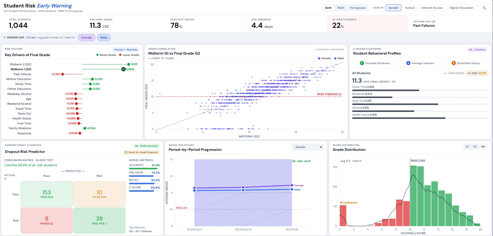
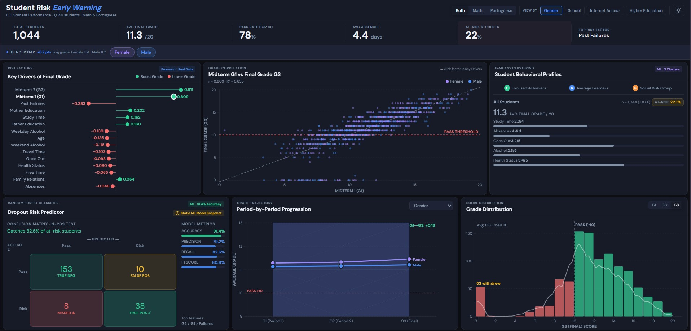

<div align="center">

# Student Risk Early Warning
### An Interactive Analytical Dashboard on the UCI Student Performance Dataset

*Identifying at-risk students before final grades are issued — and explaining why.*

[](https://archive.ics.uci.edu/dataset/320/student+performance)
[](https://d3js.org/)
[](https://scikit-learn.org/)
[](#)
[](https://vercel.com/)

</div>

---

## Live Demo

> **Live at:** *deployed on Vercel — see [https://student-uci-dashboard.vercel.app/](https://student-uci-dashboard.vercel.app/) section to launch your own*
>
> **Local preview:** `python -m http.server 8000 --directory web` → open <http://localhost:8000>

<table>
<tr>
<td width="50%"><b>Light Mode</b></td>
<td width="50%"><b>Dark Mode</b></td>
</tr>
<tr>
<td></td>
<td></td>
</tr>
</table>

---

## At a Glance

| | |
|---|---|
| **Cohort** | 1,044 students · 2 schools · 2 subjects (Math + Portuguese) |
| **Target** | `at_risk = G3 < 10` · 22.0% minority class |
| **Best predictor** | G2 midterm — Pearson *r* = 0.91, *R²* = 0.83 |
| **Random Forest** | hold-out *n* = 209: accuracy 91.4% · precision 79.2% · **recall 82.6%** · F1 80.9% |
| **5-fold CV (RF)** | recall 79.1% ± 8.1 pp · F1 82.0% ± 3.9 pp — stable across folds |
| **Baselines (hold-out)** | LogReg recall 91.3% (F1 77.1%) · Decision Tree recall 76.1% (F1 73.7%) — RF leads on F1 |
| **Subject-stratified RF** | Math (n=395) recall **88.5%** · Portuguese (n=649) recall **75.0%** — Subject toggle switches models live |
| **Fairness audit (sex)** | Female recall **91.3%** (n=115, 2 missed) · Male recall **73.9%** (n=94, 6 missed) · disparity ratio 0.81 (just above 4/5 rule) |
| **K-Means clusters** | Focused Achievers (12.6% at-risk) · Average Learners (21.4%) · Social Risk Group (29.4%) — subject-stratified: Math Social Risk **42.1%** vs Por Social Risk **21.3%** |
| **Diagnostic finding** | Bimodal G3 — primary mode at 11/20 + 53 students (5.1%) who withdrew (G3 = 0) |
| **Stack** | D3.js v7 · Vanilla JS (ES modules, no bundler) · Python · scikit-learn |
| **Build step** | None. Zero install on the front end. |

---

## Table of Contents

1. [Academic Context](#1-academic-context)
2. [What Makes This Dashboard Distinctive](#2-what-makes-this-dashboard-distinctive)
3. [Architecture](#3-architecture)
4. [Tech Stack](#4-tech-stack)
5. [Features](#5-features)
6. [Repository Layout](#6-repository-layout)
7. [Reproducing the Pipeline](#7-reproducing-the-pipeline)
8. [Deployment](#8-deployment)
9. [Limitations and Future Work](#9-limitations-and-future-work)
10. [Citation](#10-citation)

---

## 1. Academic Context

**Dataset.** Paulo Cortez & Alice Silva, *Using Data Mining to Predict Secondary School Student Performance* (2008). Two Portuguese secondary schools (Gabriel Pereira, Mousinho da Silveira), two subjects (Mathematics *n* = 395, Portuguese *n* = 649), **combined *n* = 1,044 students**, 33 raw attributes covering demographics, family background, schooling support, lifestyle, and three grade periods (G1 midterm, G2 midterm, G3 final, each on a 0–20 scale).

**Target construction.** Following the Portuguese pass threshold, a binary label `at_risk = 1` is assigned when `grade_final < 10`. This yields a **22.0% minority class** (230 at-risk students) — an imbalanced classification problem that motivates `class_weight='balanced'` in the classifier and **recall** as the headline metric.

**Six research questions, six dashboard cards.**

| # | Question | Method | Evidence card |
|---|---|---|---|
| RQ1 | Which numeric features correlate most strongly with G3? | Pearson *r* | *Key Drivers of Final Grade* |
| RQ2 | How well does each feature predict G3 at the individual level? | Scatter + OLS (*r*, *R²*, slope) | *Grade Correlation* |
| RQ3 | Can students be grouped into interpretable behavioural personas? | K-Means (*k* = 3) on standardised lifestyle features | *Student Behavioural Profiles* |
| RQ4 | Can a model flag at-risk students accurately enough to act on, and which errors matter? | Random Forest + confusion matrix | *Dropout Risk Predictor* |
| RQ5 | How do grades evolve G1 → G2 → G3, and do subgroups diverge? | Spaghetti + group means + ±1σ bands | *Period-by-Period Progression* |
| RQ6 | What structure does the grade distribution reveal? | Histogram + KDE | *Grade Distribution* |

**Key empirical findings.**

> - **G2 is an almost-deterministic predictor of G3** — *r* = 0.91, *R²* = 0.83. G1 follows at *r* = 0.81. Past `failures` is the strongest negative signal (*r* = −0.38).
> - **The G3 distribution is bimodal** — a primary Gaussian centred near 11/20 *plus* a secondary spike at G3 = 0 corresponding to **53 students (5.1%) who withdrew** before the final exam. A failure mode invisible to summary statistics alone.
> - **K-Means (k = 3) recovers academically meaningful clusters** — *Focused Achievers* (n = 207, grade 12.5, at-risk 12.6%), *Average Learners* (n = 524, grade 11.3, at-risk 21.4%), and a *Social Risk Group* (n = 313, grade 10.6, at-risk 29.4%) whose absences and weekend alcohol scores are both ~2× the cohort mean. **Subject-stratified K-Means** reveals that the same Social Risk archetype carries 42.1% at-risk in Mathematics versus 21.3% in Portuguese — a 20-point operational-urgency spread invisible to the combined model. The Subject toggle re-fits all three clusters live.
> - **A 200-tree Random Forest reaches recall 82.6%** on a stratified 20% hold-out (*n* = 209): of 46 true at-risk students, 38 are caught and **8 are missed** — the single quantity most relevant to an early-warning use case. 5-fold stratified cross-validation confirms the result is broadly stable (mean recall 79.1% ± 8.1 pp; mean F1 82.0% ± 3.9 pp). Against baselines on the same split: Logistic Regression catches more at-risk students (recall 91.3%) but raises 21 false alarms (precision 66.7%); a Decision Tree misses 11 (recall 76.1%). The Random Forest's F1 80.9% is the best-balanced of the three.
> - **Subject-stratified Random Forests** trained on Mathematics-only and Portuguese-only cohorts reveal that the combined model is essentially a weighted average. Math recall climbs to **88.5%** (F1 85.2%) because the at-risk class is denser (38.7% base rate), while Portuguese recall drops to **75.0%** (F1 69.8%) because the at-risk class is more rare (12.4%) and the model has fewer positive examples to learn from. The dashboard's *Subject* toggle now switches between all three models live, surfacing this trade-off to the user.
> - **Pearson r misses non-linear effects** that the Random Forest captures. *Absences* is the headline example: Pearson r = −0.046 (rank 15 of 15 — dropped from the lollipop visual) versus RF Gini importance 0.052 (rank 4 of 13). The discrepancy is consistent with a *threshold* relationship: a student with zero-to-three absences passes at cohort-average rates, but a student with ten or more is sharply more at-risk — a behaviour the linear coefficient averages out to near zero. The *Key Drivers* card now toggles between Pearson r and RF Importance so this hidden non-linearity is directly inspectable.
> - **Gender fairness audit reveals an honest disparity.** On the held-out test set the Random Forest catches 91.3% of at-risk female students (2 missed of 23) but only 73.9% of at-risk male students (6 missed of 23). The 0.81 recall disparity ratio is *just* above the 0.80 four-fifths-rule threshold for disparate impact, which we report transparently. The selection-rate disparity is much smaller (0.89) — the model is not under-flagging males in aggregate; rather it makes more false-negative errors on them. Mitigation directions are listed in REPORT §7.3.2.

---

## 2. What Makes This Dashboard Distinctive

This is not a generic EDA notebook. Specific design decisions were made to align the visualisation with the *use case* — early academic warning — rather than with chart aesthetics:

- **Recall, not accuracy, leads the model card.** A 91% accuracy on a 22% minority class is misleading; the dashboard shows the **MISSED ⚠** false-negative cell in red precisely because that is the operational cost.
- **Cross-card linking — reasoning by clicks.** Clicking a feature in *Key Drivers* repoints the *Grade Correlation* scatter to that feature. The four-step reasoning pipeline (which signals matter? → is the relationship real? → are there student types? → can we predict?) is **literally clickable** in order.
- **Seeded jitter for stability.** Grades are integer-valued and heavily over-plotted. Jitter is generated from a deterministic LCG (`d3.randomLcg(0.42)`) so identical filter state always produces identical dot positions across redraws — the chart never visually flickers when you toggle a filter.
- **Data-tight Y-axis on the trajectory chart.** A fixed [0, 20] domain makes 1–2-point group differences invisible. The progression chart auto-zooms to where the mean lines actually live, with a ±1.5-grade buffer.
- **Theme that actually persists.** Toggle dark mode → reload → still dark. First-load respects `prefers-color-scheme`. All charts redraw on theme change (no stale cached colours).
- **One single-viewport layout.** Six charts on a 24-column CSS grid, no scroll on a 1440 × 900 display. The reasoning fits on one screen.
- **Zero front-end build step.** D3 is loaded as ES module from a CDN; the entire app is ~1,200 lines of plain JavaScript across seven modules. Any static host works.
- **Accessibility baseline.** Focus rings on every interactive element, `prefers-reduced-motion` respected, `aria-live` KPI bar, keyboard-activated chips, `aria-pressed` theme toggle.

---

## 3. Architecture

```
┌──────────────────────────────────────────────────────────────────────┐
│                          OFFLINE (Python)                            │
│                                                                      │
│  data/raw/{student-mat.csv, student-por.csv}                         │
│           │                                                          │
│           ▼                                                          │
│   analysis/analyze.py  ──► Pearson r · K-Means(k=3) · RandomForest   │
│           │                                                          │
│           ├──► data/processed/clean_students.csv                     │
│           ├──► web/data/clean_students.csv                           │
│           └──► numbers hardcoded into web/charts/{importance,        │
│                personas, risk}.js  (re-run pipeline to refresh)      │
└──────────────────────────────────────────────────────────────────────┘
                                  │
                                  ▼
┌──────────────────────────────────────────────────────────────────────┐
│                       BROWSER (D3 v7 · ESM)                          │
│                                                                      │
│   web/index.html  ──► main.js  ──► state · filters · theme           │
│                          │                                           │
│                          ├─► charts/importance.js  (RQ1)             │
│                          ├─► charts/scatter.js     (RQ2)             │
│                          ├─► charts/personas.js    (RQ3)             │
│                          ├─► charts/risk.js        (RQ4)             │
│                          ├─► charts/progression.js (RQ5)             │
│                          └─► charts/histogram.js   (RQ6)             │
│                                                                      │
│   No bundler · no install · CSS variables drive light/dark theme     │
└──────────────────────────────────────────────────────────────────────┘
```

---

## 4. Tech Stack

### Analysis layer (offline, one-shot)

| Purpose | Library |
|---|---|
| Data wrangling | `pandas`, `numpy` |
| Statistical inference | `scipy.stats`, `statsmodels` (OLS with robust SE) |
| Unsupervised learning | `sklearn.cluster.KMeans` + `StandardScaler` |
| Supervised learning | `sklearn.ensemble.RandomForestClassifier`, stratified `train_test_split`, 5-fold `cross_val_score` |
| Evaluation | `sklearn.metrics.confusion_matrix`, `precision_recall_fscore_support`, `classification_report` |
| Notebook plots | `matplotlib`, `seaborn` |

### Presentation layer (browser, zero build step)

| Purpose | Technology |
|---|---|
| Structure | Semantic HTML5 (`<main>`, `<header>`, ARIA live tooltip) |
| Styling | Vanilla CSS with CSS custom properties, `color-mix()`, 24-column grid, light/dark via `data-theme` attribute |
| Typography | DM Sans (one family, via Google Fonts, mapped to `--font-body`/`--font-display`/`--font-mono`) |
| Charting | **D3.js v7** imported as ES module from `jsdelivr` CDN — no bundler, no build step |
| App code | Vanilla ES modules (`type="module"`), one file per chart |
| Persistence | `localStorage` for theme preference, `prefers-color-scheme` fallback |
| Responsiveness | `ResizeObserver` redraws each SVG on container size change; seeded LCG jitter keeps scatter positions stable |
| Hosting | Any static host — Vercel (configured), GitHub Pages, Netlify, S3 |

> The front end ships **no dependencies to install** — every asset is either local or CDN-linked, and the entire app is ~1,200 lines of plain JavaScript across seven modules.

---

## 5. Features

### 5.1 Global controls
- **Subject toggle** — *Both / Math / Portuguese*, filters the underlying cohort.
- **View-by switcher** — recolours and regroups every chart by **Gender / School / Internet access / Higher-education aspiration**.
- **Chip filter** — per-view group toggles (e.g. show Female-only or GP-school-only). Additive; cannot collapse to empty.
- **Dark-mode toggle** — full palette swap via CSS `data-theme`; persisted to `localStorage`; respects OS preference on first load.
- **KPI bar** — six live metrics (cohort size, avg G3, pass rate, avg absences, at-risk %, top risk factor) recomputed on every filter change.
- **Insight strip** — dynamic group-gap headline (e.g. *"Gender Gap: +0.2 pts — avg grade: Female 11.4 · Male 11.2"*), updated per view.

### 5.2 Chart cards

| Card | Visualisation | Interaction |
|---|---|---|
| **Grade Correlation** *(scatter)* | G3 ~ X-feature with seeded jitter, OLS line, *r* / *R²* in header, pass threshold at G3 = 10 | X-axis bound to *Key Drivers* — clicking a factor there repoints the scatter |
| **Key Drivers of Final Grade** *(lollipop)* | **Dual-mode toggle**: *Pearson r* (top 10 of 15 numeric features, green/red by sign) **or** *RF Importance* (top 10 of 13 RF input features, blue, non-linear) | Click toggle to switch modes; click any dot → drives the scatter; hover → metric value + interpretation |
| **Student Behavioural Profiles** *(K-Means personas)* | 3 cluster tabs: name, size, share, average G3, at-risk badge, six attribute bars | Tab click → switch active persona; hover an attribute → group interpretation |
| **Dropout Risk Predictor** *(confusion matrix + metrics)* | 2×2 matrix with explicit ACTUAL ↓ / ← PREDICTED → axes; cells colour-coded by outcome (MISSED ⚠ in red); 4 metrics as bars | Hover any cell or metric → operational meaning |
| **Period-by-Period Progression** *(trajectory)* | Up to 120 spaghetti lines + group mean ± 1σ bands; data-tight Y-axis; G1 → G3 delta annotation; "no significant gap" hint when groups overlap | Group-by dropdown switches grouping dimension independently of the global view |
| **Grade Distribution** *(histogram + KDE)* | Bins coloured pass / fail at threshold 10; KDE overlay; *N withdrew* annotation on G3 = 0 spike | G1 / G2 / G3 toggle to compare period distributions |

### 5.3 Interaction details
- Global tooltip with edge-aware positioning (flips around the cursor near right/top margins; final-clamps so it never overflows).
- Each chart redraws on container resize, not viewport resize — card-level layout changes update only their owning chart.
- Scatter jitter uses a seeded LCG → identical filter state always yields identical dot positions across re-renders. No flicker.

---

## 6. Repository Layout

```
student-performance-UCI/
├── README.md                  ← you are here
├── USECASE.md                 ← step-by-step problem framing
├── LICENSE
├── vercel.json                ← static deploy config (outputDirectory: web)
├── analysis/
│   ├── analyze.py             ← one-shot pipeline: clean → corr → K-Means → RF → export
│   └── eda.ipynb              ← annotated notebook companion
├── data/
│   ├── raw/
│   │   ├── student-mat.csv    ← UCI raw — Math
│   │   └── student-por.csv    ← UCI raw — Portuguese
│   └── processed/
│       └── clean_students.csv
├── visual/                    ← static plots from the notebook
│   ├── correlations.png
│   ├── elbow.png
│   ├── g2_vs_g3.png
│   └── grade_distributions.png
├── docs/screenshots/          ← README assets
│   ├── dashboard-light.jpg
│   └── dashboard-dark.jpg
└── web/                       ← deploy root
    ├── index.html
    ├── style.css
    ├── main.js
    ├── data/clean_students.csv
    └── charts/
        ├── scatter.js
        ├── importance.js
        ├── personas.js
        ├── risk.js
        ├── progression.js
        ├── histogram.js
        └── utils.js           ← tooltip positioning helper
```

---

## 7. Reproducing the Pipeline

### 7.1 Regenerate derived data and ML numbers
```bash
cd analysis
python -m pip install pandas numpy scikit-learn scipy statsmodels matplotlib seaborn
python analyze.py
```
Prints Pearson correlations, K-Means cluster statistics for three subject stratifications (`===CLUSTERS===` combined, `===CLUSTERS_MATH===`, `===CLUSTERS_POR===` — semantically aligned so *focused / average / social_risk* keep the same identity across subjects), Random Forest metrics for three subject stratifications (`===RF===` combined, `===RF_MATH===`, `===RF_POR===`), the RF feature-importance vector (`===RF_IMPORTANCE===`, used by the dual-mode toggle in *Key Drivers*), a 5-fold stratified cross-validation summary (`===CV===`) on the combined Random Forest, hold-out metrics for two baseline classifiers (`===BASELINES===` — `logreg`, `dtree`), and a gender-conditional fairness audit (`===FAIRNESS===` — female / male / disparity-ratio block). Writes `clean_students.csv` to both `data/processed/` and `web/data/`. The figures hardcoded in `web/charts/risk.js` and `web/charts/personas.js` reflect all three subject stratifications; those in `web/charts/importance.js` cover both Pearson r (top 10) and RF Gini importance (top 10).

### 7.2 Launch the dashboard locally
```bash
python -m http.server 8000 --directory web
# then open http://localhost:8000
```
A static server is required because the front end uses ES module imports and a CSV fetch — neither work from `file://` URLs.

### 7.3 Tested environment
- Python 3.11, scikit-learn 1.4
- Chrome / Firefox / Edge — current stable
- Random seeds fixed (`random_state=42`, `d3.randomLcg(0.42)`) for full reproducibility

---

## 8. Deployment

The project is configured for **one-click static deploy on Vercel**:

```bash
# Option A — Vercel CLI
npm i -g vercel
vercel        # follow the prompts; pick this repo's root

# Option B — GitHub integration
# 1. Go to https://vercel.com/new
# 2. Import LineLuLan/student-performance-UCI
# 3. Deploy. vercel.json directs Vercel to serve web/ as the root.
```

`vercel.json` declares `outputDirectory: "web"` so Vercel serves the dashboard directly with no build step. Any other static host (GitHub Pages, Netlify, Cloudflare Pages, S3) works identically by pointing the root at `web/`.

---

## 9. Limitations and Future Work

- **Hard-coded ML numbers.** Pearson *r*, K-Means stats, and RF metrics are currently *baked into* `web/charts/*.js`. Re-running `analyze.py` regenerates the CSV but those numbers must be copied across manually. Trade-off: keeps the front end build-free.
- **Pearson only for Key Drivers.** Non-linear relationships (e.g. a U-shape on `goout`) are under-represented. Spearman or mutual information would be a reasonable extension.
- **Cohort-wide model.** The Random Forest is trained on Math + Portuguese combined rather than per-subject; a stratified split would let the dashboard report subject-specific recall.
- **Read-only dashboard.** A natural next step is a "predict for one student" input panel that runs the classifier client-side via a serialised model (ONNX or a hand-rolled tree ensemble in JS).
- **Dormant features.** Categorical demographics (`address` urban/rural, `pstatus`, `guardian`, parental jobs, support flags) are present in the cleaned CSV but not yet visualised.

---

## 10. Citation

> P. Cortez and A. Silva. *Using Data Mining to Predict Secondary School Student Performance.* In A. Brito and J. Teixeira, editors, *Proceedings of 5th Future Business Technology Conference (FUBUTEC 2008)*, pp. 5–12, Porto, Portugal, April 2008. EUROSIS.

Dataset hosted by the UCI Machine Learning Repository: <https://archive.ics.uci.edu/dataset/320/student+performance>

## License

See [`LICENSE`](LICENSE) for distribution terms. The UCI dataset itself is released under a CC BY 4.0 licence by the original authors.
